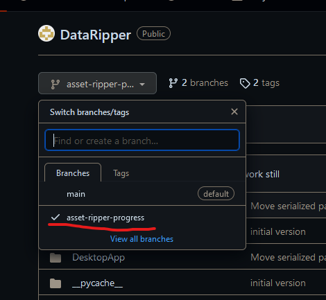
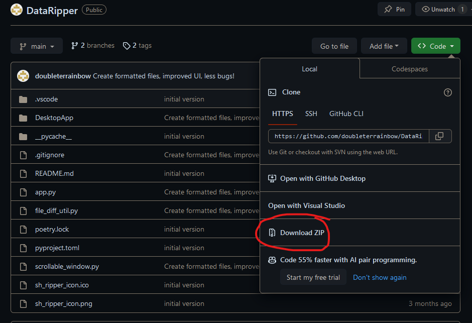
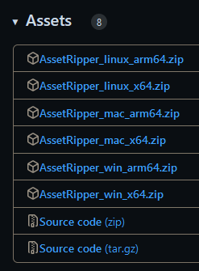
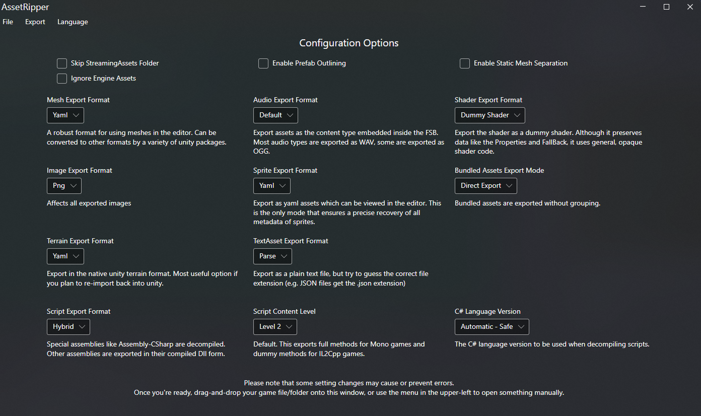

If you are familiar with git, you can clone the repository. Otherwise, you can download the ZIP of the project.

First, check the branch:



Next, download from the "Code" button:



## Build Tools
This project runs on Python using [poetry](https://python-poetry.org/).

### Python Installation
Python is installed by default on MacOS. For Windows, there's lots of instructions online, such as [this one](https://www.digitalocean.com/community/tutorials/install-python-windows-10).
The python installer can be downloaded from [here](https://www.python.org/downloads/windows/).

### Python Setup
Verify python is installed by searching for and opening the Terminal app in windows, and running `python --version`. There should be some output such as "Python 3.10.2".

Next, install poetry running the following command:
```powershell
(Invoke-WebRequest -Uri https://install.python-poetry.org -UseBasicParsing).Content | py -
```
(see the docs [here](https://python-poetry.org/docs/#installation) for more instructions)

Similar to verifying the python installation, poetry can be verified with
```bash
poetry --version
```

That includes all the build tools needed to run the app.

## Resources

You'll need 2 exports to extract data from the game.

1. Extracted assets from AssetRipper
2. Code from DnSpy

## AssetRipper
Asset Ripper can be found [here](https://github.com/AssetRipper/AssetRipper/releases).

Asset Ripper releases should include an Assets section:



Download the relevant zip (such as **win_x64**) and extract it. Within those files should be a file named `AssetRipper.exe` which can be run.

Asset Ripper will look like this once opened:



You can either drag-and-drop the game folder into this window or use File > Open Folder. The selected folder should be what is opened when in Steam > Gear Icon > Manage > Browse local files.

**Leave all settings as default.** 

Asset Ripper will take time to load all the game files, and then put them in a semi-browsable state.

In the menu bar, select Export > Export all files. Make a note of the selected folder. **I would recommend creating a new folder for this purpose.**

## DnSpy
DnSpy can be found [here](https://github.com/dnSpy/dnSpy)

Once dnSpy is open, go to File > Open and select `Sun Haven\Suh Haven_Data\Managed\SunHaven.Core.dll`

File > Export to Project

Pick any folder to export this, but keep the location in mind as you will need it later.

# Running

For this to run you must be inside the project folder. The easiest way to get there is to find the extracted github ZIP (probably named "DataRipper-asset-ripper-progress"), right-click the folder, and select "Open in Terminal".


Once all of the above has been completed, the program can be run with:
```bash
poetry run python .\run_parser
```

You should begin receiving prompts for the directories created earlier. To get the path of the directories, on Windows 11 you can press Ctrl+Shift+C to copy the path (or right-click > Copy as path).

*Note: When selecting outputs, use spacebar to check or uncheck, and enter to submit.*
